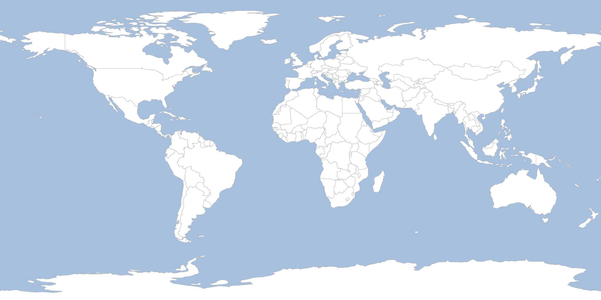

Generate Geodetic Tiles
=======================

.. code-block:: bash

    #!/bin/bash
    rm tiles.gpkg

    geoc tile generate -l "type=geopackage file=tiles.gpkg name=world_geodetic pyramid=geodetic" \
        -m "layertype=layer file=naturalearth.gpkg layername=ocean style=ocean.sld" \
        -m "layertype=layer file=naturalearth.gpkg layername=countries style=countries.sld" \
        -s 0 \
        -e 3 \
        -v

    geoc tile pyramid -l "type=geopackage file=tiles.gpkg name=world_geodetic" -o json

    geoc tile stitch raster -l "type=geopackage file=tiles.gpkg name=world_geodetic" \
        -o world_geodetic_2.png -z 2

