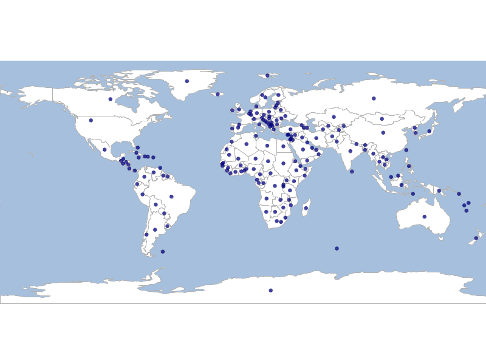

Create Centroids from a Vector Layer
====================================

.. code-block:: bash

  geoc vector centroid -i naturalearth.gpkg -l countries -o countries_centroids.shp

  geoc vector defaultstyle --color navy -o 0.75 -i countries_centroids.shp > countries_centroids.sld

  geoc map draw -f vector_centroid.png -l "layertype=layer file=naturalearth.gpkg layername=ocean style=ocean.sld" \
      -l "layertype=layer file=naturalearth.gpkg layername=countries style=countries.sld" \
      -l "layertype=layer file=countries_centroids.shp style=countries_centroids.sld"

